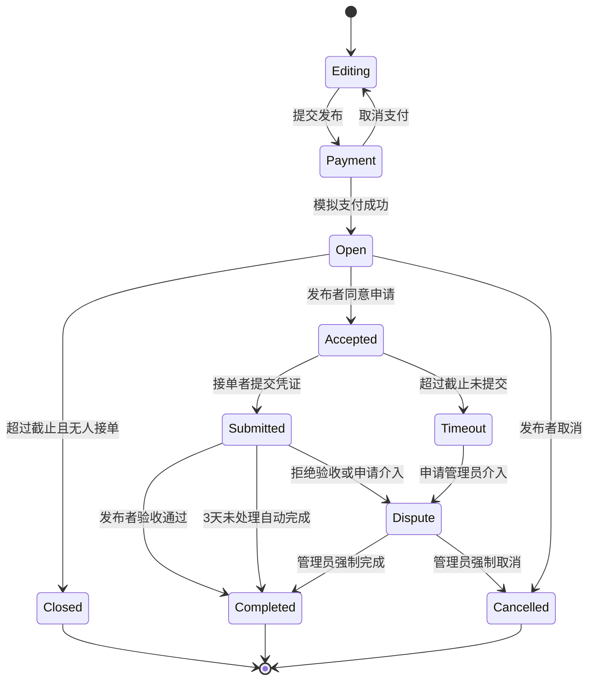
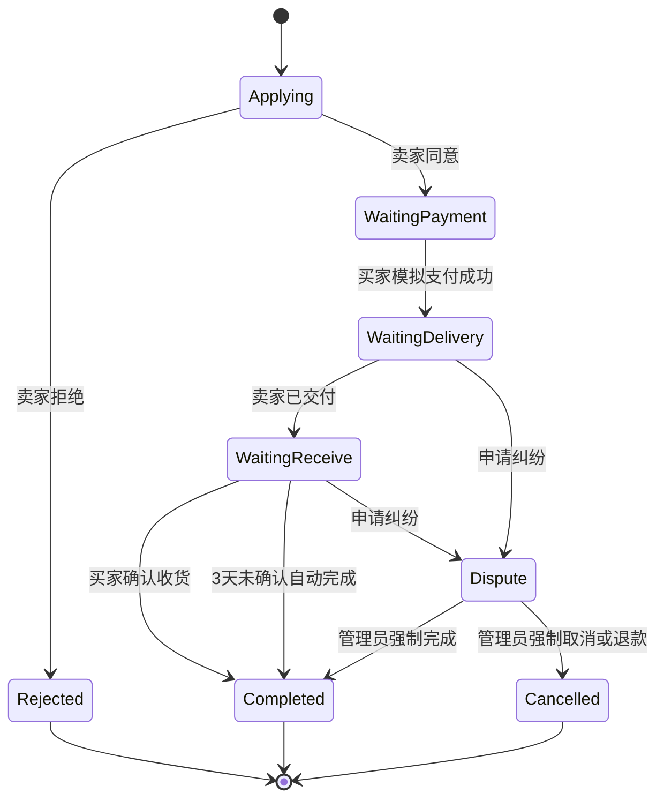
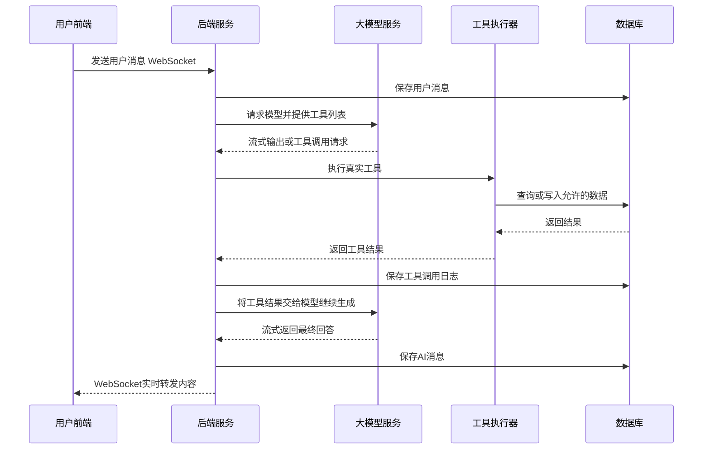

# 校园智能生活服务平台详细需求与实现要求文档

**版本**：V1.1 讨论整合版
**日期**：2026-06-30
**适用场景**：软件工程课程设计
**技术栈**：Vue3 + Naive UI + Node.js + Express + SQL Server
**数据库名称**：`CampusLifeService`

---

## 一、文档说明

### 1.1 项目背景

校园生活中存在任务互助、校园交流、闲置交易、校园咨询等多类高频需求，但传统方式存在信息分散、沟通效率低、资源流转慢、服务入口不统一等问题。

本项目拟建设“校园智能生活服务平台”，统一提供以下能力：

-	统一用户认证与个人中心。
-	统一私信、通知、卡片交互体系。
-	校园任务互助。
-	校园社区论坛。
-	校园二手市场。
-	校园信息智能体。

### 1.2 项目目标

通过一个统一的网页端平台，为校园用户提供生活服务入口，实现：

-	用户体系统一。
-	服务入口统一。
-	消息通知统一。
-	业务数据可追踪。
-	AI 能力真实接入。
-	后台支持简单管理与演示。

### 1.3 项目范围

本系统包含以下子系统：

-	校园智能生活服务主系统。
-	校园任务互助系统。
-	校园社区论坛系统。
-	校园二手市场系统。
-	校园信息智能体系统。
-	管理员后台系统。

### 1.4 本期明确不实现或简化的内容

-	不实现微信快捷登录。
-	不实现真实短信验证码。
-	不实现真实支付。
-	不实现虚拟钱包或用户余额。
-	不接入浏览器系统通知弹窗。
-	不做移动端专项适配。
-	不做真实地图定位和距离计算。
-	不做向量数据库和 Embedding 检索。
-	不做 AI 推荐 Tag。
-	不做 AI 推荐商品分类。
-	不做 Tag / 分类相似性检查。
-	不做 Tag / 分类去重审核。
-	不允许 AI 查询用户个人数据。
-	不允许 AI 直接替用户发布帖子、下单、接单、购买商品。

---

## 二、总体技术与部署要求

### 2.1 技术架构

|层级|技术要求|
|---|---|
|用户前端|Vue3 + Naive UI|
|管理员前端|Vue3 + Naive UI，单独站点，不共用用户体系|
|后端|Node.js + Express|
|数据库|SQL Server|
|实时通信|WebSocket|
|AI 接口|OpenAI Chat Completions 兼容格式|
|文件存储|后端本地文件存储，数据库保存访问路径|

### 2.2 数据库配置

-	使用本地 SQL Server。
-	连接地址：`localhost:8887`
-	用户名：`sa`
-	密码：`123456Aa`
-	数据库名：`CampusLifeService`
-	系统启动时应检测数据库连接是否可用。
-	开发环境可使用本地配置文件。
-	实际部署时建议使用环境变量保存数据库密码。

### 2.3 前端部署方式

-	用户端访问入口：`/`
-	管理员端访问入口：`/admin`
-	前端构建产物放置于后端 `/public` 目录下。
-	Express 负责静态托管前端资源。
-	用户端与管理员端使用不同前端入口和不同登录体系。

### 2.4 认证技术方案

-	普通用户登录后由后端签发 JWT。
-	管理员登录后由后端签发管理员 JWT。
-	用户 Token 与管理员 Token 不互通。
-	WebSocket 建立连接时也必须携带 Token 完成鉴权。
-	用户密码必须加密存储。
-	管理员账号本期按课程设计要求写死：
	-	账号：`admin`
	-	密码：`123456`

---

## 三、角色与权限

### 3.1 普通用户

普通用户可以：

-	注册和登录。
-	维护个人资料。
-	发布、申请、完成任务。
-	发帖、评论、点赞、收藏、关注。
-	发布和购买二手商品。
-	使用私信与卡片交互。
-	使用校园智能体。
-	查看通知中心。
-	提交举报、纠纷和分类申请。

### 3.2 管理员

管理员可以：

-	登录管理员后台。
-	查看用户列表。
-	处理举报。
-	处理纠纷仲裁。
-	处理商品分类新增申请。
-	维护任务分类与系统参数。
-	维护二手商品分类。
-	维护知识库。
-	配置大模型接口。
-	查看 AI 风险报警记录。
-	查看 AI 咨询分类统计。
-	查看社区热点、词云、AI 总结。
-	查看任务主要倾向分析。
-	开启或关闭后台 Mock 数据开关。
-	执行封禁、禁言、限制发布、扣信用分等处理。

### 3.3 AI Agent

AI Agent 是服务端运行的真实智能体，不是前端模拟。

AI Agent 可以：

-	调用真实工具查询公开任务、公开商品、公开帖子、知识库。
-	调用工具生成“任务发布草案卡片”。
-	调用工具向用户展示任务、帖子、商品卡片。
-	调用工具记录用户咨询分类。
-	调用工具上报心理风险或严重错误倾向。
-	基于工具结果生成回答。

AI Agent 不可以：

-	查看用户个人资料。
-	查看用户私信。
-	查看用户订单、个人任务、个人交易等私有数据。
-	替用户直接发布正式任务。
-	替用户直接购买商品。
-	替用户直接发帖。
-	替用户直接接单。
-	替用户修改系统业务状态。

### 3.4 系统定时任务

系统定时任务用于：

-	每周恢复用户信用分。
-	每天扫描任务与订单超时状态。
-	每周一 00:00 生成上一周社区词云数据。
-	每周一 00:00 生成上一周社区 AI 热点总结。
-	定期汇总任务关键词和任务倾向数据。

---

## 四、用户认证与账号体系

### 4.1 注册方式

系统支持普通用户注册，注册字段包括：

|字段|要求|
|---|---|
|学号|必填，12 位纯数字|
|手机号|必填，仅做格式校验，不发送短信验证码|
|密码|必填，加密存储|
|昵称|可选，后续可修改|

### 4.2 校园身份验证

-	系统采用假的校园身份验证。
-	用户输入的学号只要满足 12 位纯数字，即自动通过校园身份验证。
-	学号通过后绑定到用户账号。
-	学号不允许用户后续修改。

### 4.3 登录方式

-	支持密码登录。
-	取消微信快捷登录。
-	手机号不发送验证码。
-	系统应支持基于 JWT 的登录态保持。

### 4.4 个人中心

用户可维护：

-	头像。
-	昵称。
-	手机号。
-	联系方式。
-	个人简介。
-	密码修改。
-	账号安全信息查看。

限制：

-	学号不可修改。
-	信用分不可由用户修改。
-	封禁状态、禁言状态、限制发布状态只能由管理员修改。

---

## 五、信用分规则

### 5.1 基础规则

|项目|规则|
|---|---|
|初始信用分|10 分|
|最高信用分|10 分|
|最低信用分|0 分|
|自动恢复|每周自动增加 1 分，上限 10 分|
|低信用提示|低于 6 分时，在任务或交易卡片中提示“该用户信用分较低”|
|接任务限制|低于 4 分时，禁止申请或接收任务|

### 5.2 扣分规则

|行为|扣分|
|---|---|
|任务已确认接单后，发布者无故取消|扣 1 分|
|任务已确认接单后，接单者无故放弃|扣 1 分|
|接单者超时未完成任务|扣 1 分|
|社区帖子举报属实|扣 4 分|
|商品举报属实|扣 4 分|
|任务或交易纠纷中被判定为过错方|扣 4 分|

### 5.3 信用分展示

-	用户主页展示信用分。
-	任务详情展示发布者信用分。
-	任务申请卡片展示申请者信用分。
-	商品详情展示卖家信用分。
-	商品购买卡片展示买家信用分。
-	信用分低于 6 分时以醒目提示展示。

---

## 六、文件与附件存储

### 6.1 存储方式

-	文件上传到后端服务器本地目录。
-	数据库仅保存文件路径、文件类型、上传用户、上传时间等元数据。
-	不接入对象存储服务。

### 6.2 文件类型

支持：

-	头像图片。
-	私信图片。
-	帖子图片。
-	商品图片。
-	任务交付凭证。
-	纠纷证据图片。
-	评价图片。

### 6.3 文件限制

-	支持格式：jpg、jpeg、png、webp。
-	单张图片大小限制：5MB。
-	上传失败时需要给出明确错误提示。

---

## 七、统一私信与卡片系统

### 7.1 私信功能

私信系统是全平台通用沟通能力。

支持：

-	一对一私信。
-	文字消息。
-	图片消息。
-	业务卡片消息。
-	历史消息分页加载。
-	消息搜索。
-	已读 / 未读状态。
-	消息免打扰。
-	消息软删除。
-	跨子系统发起会话。

### 7.2 实时通信要求

-	私信必须使用 WebSocket 实现实时对话。
-	双方在线时，消息实时推送到聊天界面。
-	卡片状态变化也通过 WebSocket 实时同步。
-	用户离线时，消息持久化保存并标记未读。
-	用户下次登录或打开私信页面时拉取未读消息。
-	不调用浏览器 Notification API。
-	不弹出系统级通知弹窗。

### 7.3 会话规则

-	每对用户之间只有一个唯一私信会话。
-	会话通过唯一会话 ID 标识。
-	消息按时间顺序存储。
-	消息删除采用软删除：
	-	用户删除消息后，只从自己的聊天界面隐藏。
	-	对方仍可看到该消息。
	-	数据库不物理删除消息。
-	本期不提供消息撤回功能。

### 7.4 通用卡片消息

卡片是一种特殊私信消息，用于承载业务操作。

支持卡片类型：

-	任务申请卡片。
-	任务验收 / 结算卡片。
-	帖子分享卡片。
-	商品购买申请卡片。
-	商品交付 / 收货卡片。
-	AI 任务发布草案卡片。
-	AI 推荐展示卡片。

### 7.5 卡片唯一性与过期

-	卡片有效期：1 天。
-	任务申请卡片唯一标识建议由任务 ID、申请人 ID、发布者 ID、卡片类型共同生成。
-	商品购买卡片唯一标识建议由商品 ID、买家 ID、卖家 ID、卡片类型共同生成。
-	同一用户对同一任务或商品重复发送相同类型卡片时：
	-	旧的未过期卡片自动失效。
	-	新卡片成为有效卡片。
-	业务状态变化后，相关卡片必须同步更新。
-	任务或商品被其他人锁定后，其他申请卡片自动失效。

### 7.6 通知中心实时刷新

-	通知中心复用 WebSocket 连接。
-	支持新通知实时刷新。
-	支持未读数实时刷新。
-	不触发浏览器系统通知弹窗。

---

## 八、统一消息通知中心

### 8.1 通知类型

系统统一汇聚以下通知：

-	私信未读提醒。
-	任务报名提醒。
-	任务状态变更提醒。
-	任务验收提醒。
-	任务结算提醒。
-	商品购买申请提醒。
-	订单状态变更提醒。
-	评论回复提醒。
-	点赞提醒。
-	收藏提醒。
-	@ 提醒。
-	关注更新提醒。
-	举报处理结果。
-	纠纷处理结果。
-	系统公告。

### 8.2 通知管理

用户可以：

-	查看全部通知。
-	按类型筛选通知。
-	单条标记已读。
-	一键全部已读。
-	删除历史通知。
-	查看未读通知数量。

---

## 九、校园任务互助系统

### 9.1 系统定位

任务互助系统面向校园用户，提供跑腿代办、学业互助、技能服务、其他互助等任务发布、申请、接单、交付、验收、结算闭环。

### 9.2 任务类型

默认任务类型：

-	跑腿代办。
-	学业互助。
-	技能服务。
-	其他互助。

管理员可维护任务分类。

### 9.3 任务发布

用户发布任务时填写：

-	任务标题。
-	任务类型。
-	任务地点 / 校区。
-	任务详情。
-	酬金金额。
-	截止时间。
-	交付要求。
-	联系方式补充说明。
-	图片附件，可选。

发布前校验：

-	用户登录状态。
-	用户是否被封禁。
-	用户是否被限制发布。
-	任务内容敏感词过滤。
-	酬金是否符合后台配置范围。
-	截止时间是否合法。

### 9.4 模拟支付

-	发布任务时需要进入模拟支付页面。
-	不接入真实微信支付、校园卡支付。
-	不维护虚拟钱包。
-	支付成功后任务正式发布。
-	取消支付时：
	-	回退到任务编辑页面。
	-	如果再次回退，则直接退出。
	-	不保留草稿数据。
-	支付、结算、退款均记录模拟支付流水。

### 9.5 任务浏览与筛选

任务市场支持：

-	按任务类型筛选。
-	按酬金区间筛选。
-	按发布时间排序。
-	按地点 / 校区筛选。
-	关键词搜索。
-	查看任务详情。
-	查看发布者信用分。
-	查看报名状态。

地点 / 校区筛选替代真实距离筛选。

可选地点示例：

-	东区。
-	西区。
-	南区。
-	北区。
-	宿舍区。
-	教学区。
-	快递点。
-	食堂。
-	图书馆。
-	其他。

### 9.6 任务申请流程

-	用户在任务详情页点击“申请”。
-	系统校验申请者信用分。
-	信用分低于 4 分时禁止申请任务。
-	校验通过后，系统自动跳转到任务发布者私信页面。
-	系统自动发送任务申请卡片。
-	发布者可在私信卡片中点击“同意”或“拒绝”。

### 9.7 多人申请规则

-	一个任务允许多个用户申请。
-	每个申请都会生成独立任务申请卡片。
-	发布者只能同意一个申请者。
-	发布者同意某个申请后：
	-	任务状态变为已接单。
	-	该用户成为最终接单者。
	-	其他申请卡片自动失效。
	-	其他申请者收到任务已被接单提示。
-	发布者拒绝某个申请时，只影响该申请人，不影响其他申请。

### 9.8 任务完成与验收

任务完成流程：

-	接单者完成任务后提交交付凭证。
-	发布者查看凭证。
-	发布者可点击“验收通过”。
-	验收通过后任务完成。
-	系统记录模拟结算流水。
-	双方可进行评价。
-	发布者也可点击“拒绝验收 / 申请管理员介入”。

### 9.9 超时规则

-	无人接单且超过截止时间：
	-	任务自动关闭。
	-	系统记录模拟退款成功流水。
	-	不扣信用分。
-	已接单但超过截止时间未提交交付凭证：
	-	任务进入超时状态。
	-	接单者扣 1 分。
	-	发布者可申请管理员介入或取消任务。
-	接单者提交凭证后，发布者 3 天内未验收：
	-	系统自动完成任务。
	-	系统记录模拟结算流水。
-	系统每天凌晨扫描超时任务。

### 9.10 任务取消规则

|任务阶段|取消规则|
|---|---|
|无人申请|发布者可取消，不扣信用分|
|已有人申请但未确认接单者|发布者可取消，不扣信用分|
|已确认接单者|发布者无故取消扣 1 分，接单者无故放弃扣 1 分|
|已提交交付凭证|原则上不能直接取消，只能验收、拒绝验收或申请管理员介入|

### 9.11 任务状态建议

### 9.12 接单者排行榜

排行榜类型：

-	周榜。
-	月榜。

统计维度：

-	累计接单量。
-	任务完成率。
-	好评率。
-	信用分。
-	历史评价。

### 9.13 任务评价

任务完成后双方可互评。

评价内容：

-	1 到 5 星评分。
-	文字评价。

规则：

-	4 星及以上计为好评。
-	评价用于好评率、排行榜、信用展示。
-	评价本身不直接扣信用分。
-	只有举报属实、纠纷判责、超时等行为才扣信用分。

### 9.14 任务后台管理

管理员可以：

-	配置任务分类。
-	配置酬金上下限。
-	配置任务超时规则。
-	配置信用分扣减规则。
-	查看任务列表。
-	查看任务详情。
-	下架违规任务。
-	处理任务举报。
-	处理任务纠纷。
-	扣除用户信用分。
-	封禁、禁言或限制发布用户。

### 9.15 任务倾向分析

系统需要支持管理员查看近期任务主要倾向。

实现要求：

-	AI 对任务详情进行关键词提取。
-	提取结果写入数据库。
-	管理员后台展示近期高频任务关键词。
-	示例关键词：
	-	取快递。
	-	取外卖。
	-	代打印。
	-	课程资料。
	-	技能服务。
-	后台支持 Mock 数据开关。

---

## 十、校园社区论坛系统

### 10.1 系统定位

社区论坛用于校园内容交流，类似小红书的信息流体验，支持帖子发布、图文内容、话题 Tag、评论、点赞、收藏、关注、热度榜、词云、AI 热点总结。

### 10.2 帖子发布

用户可发布：

-	纯文字帖子。
-	图文帖子。
-	求助帖。
-	经验分享帖。

发布字段：

-	标题。
-	正文内容。
-	图片，可选。
-	帖子类型。
-	用户输入 Tag。
-	可见状态，默认公开。

发布校验：

-	用户必须登录。
-	用户未被封禁。
-	用户未被限制发布。
-	用户未被禁言。
-	内容进行本地敏感词过滤。
-	命中严重敏感词则禁止发布。
-	未命中则直接发布。
-	不做发布前人工审核。

### 10.3 社区 Tag

Tag 规则：

-	用户手动输入 Tag。
-	每个帖子最多 5 个 Tag。
-	单个 Tag 最长 20 个字符。
-	Tag 保存前裁剪前后空格。
-	Tag 不做 AI 推荐。
-	Tag 不做相似检查。
-	Tag 不做去重审核。
-	Tag 不需要用户申请。
-	Tag 不需要人工审核。
-	Tag 仍需进行本地敏感词过滤。
-	通过后的 Tag 写入 Tag 数据库。
-	Tag 用于社区统计、词云、热点分析。

### 10.4 内容展示

前台社区首页采用类似小红书的瀑布流布局。

展示内容：

-	帖子封面图。
-	标题。
-	作者昵称。
-	作者头像。
-	点赞数。
-	评论数。
-	Tag。
-	发布时间。

### 10.5 搜索与筛选

支持：

-	关键词搜索。
-	按 Tag 筛选。
-	按作者筛选。
-	按发布时间筛选。
-	按热门程度排序。
-	按最新发布排序。

### 10.6 评论与互动

支持：

-	一级评论。
-	楼中楼二级回复。
-	评论点赞。
-	@ 用户。
-	评论举报。
-	帖子点赞。
-	帖子收藏。
-	帖子分享。
-	关注作者。
-	个人主页展示用户发布内容。

@ 用户、评论回复、点赞、关注等事件需要进入通知中心。

### 10.7 热度榜

社区提供帖子热度榜：

-	日榜。
-	周榜。
-	总榜。

基础热度分计算：

|指标|权重|
|---|---|
|浏览量|× 1|
|点赞数|× 3|
|评论数|× 5|
|收藏数|× 4|
|分享数|× 6|

时间规则：

-	日榜统计当天数据。
-	周榜统计最近 7 天数据。
-	总榜统计总数据，并使用简化时间衰减。
-	课程设计中不要求实现复杂算法，但需体现新内容更容易上榜。

### 10.8 词云

-	每周一 00:00 自动统计上一周 Tag 数据。
-	生成词云数据。
-	前端通过 Canvas 或词云组件动态渲染。
-	词云展示在排行榜上方。
-	管理员后台也展示词云数据。

### 10.9 AI 社区热点总结

系统保留 AI 文字总结功能。

要求：

-	AI 不生成 Tag。
-	AI 根据已有帖子、用户输入 Tag、热度数据生成近期社区热点与倾向总结。
-	每周一 00:00 与词云一起自动生成。
-	前台社区热度榜页面展示 AI 总结。
-	管理员后台社区分析页面展示 AI 总结。
-	管理员可手动点击“重新生成总结”。
-	如果后台 Mock 开启，则可展示 Mock 总结。

### 10.10 社区举报与管理

用户可以举报：

-	违规帖子。
-	不当评论。
-	恶意攻击。
-	虚假信息。

管理员可以：

-	删除帖子。
-	删除评论。
-	处理举报。
-	禁言用户。
-	封禁用户。
-	限制发布。
-	扣信用分。

举报属实：

-	社区帖子违规扣 4 分。
-	严重违规可封禁或限制发布。

---

## 十一、校园二手市场系统

### 11.1 系统定位

二手市场用于校园闲置物品交易，支持商品发布、浏览、搜索、分类导航、购买申请、私信卡片沟通、模拟担保支付、交付确认、评价、举报和纠纷仲裁。

### 11.2 商品发布

用户发布商品时填写：

-	商品名称。
-	商品分类。
-	价格。
-	成色。
-	详情描述。
-	商品图片。
-	交易方式。
-	自提地点或说明。

发布校验：

-	用户必须登录。
-	用户未被封禁。
-	用户未被限制发布。
-	商品标题和描述进行本地敏感词过滤。
-	商品分类必须从管理员配置的分类中选择。
-	初筛通过后直接上架。
-	不做商品发布前人工复审。

### 11.3 商品分类

分类规则：

-	商品分类由管理员配置。
-	最多支持三级分类。
-	前台分类导航类似淘宝左侧竖向分类。
-	用户发布商品时只能选择已有分类。
-	不允许用户直接创建分类。
-	不做 AI 推荐分类。
-	不做相似分类检查。
-	不做分类去重审核。

### 11.4 分类新增申请

当用户认为分类不全时，可以申请新增分类。

申请字段：

-	申请分类名称。
-	期望上级分类。
-	申请理由。

流程：

-	用户提交分类申请。
-	申请进入管理员后台。
-	管理员可通过或拒绝。
-	通过后分类进入分类库。
-	拒绝时管理员填写拒绝原因。
-	如果商品发布依赖该分类，用户需要等待分类通过后再选择该分类发布商品。
-	系统不做自动发布。

### 11.5 商品浏览与筛选

支持：

-	首页推荐。
-	热门分类。
-	最新上架。
-	分类导航。
-	关键词搜索。
-	价格区间筛选。
-	成色筛选。
-	发布时间筛选。
-	交易方式筛选。
-	商品详情查看。
-	商品图片放大查看。
-	收藏商品。
-	联系卖家。

### 11.6 按年级推荐商品

系统提供独立的年级推荐页面。

年级来源：

-	从用户 12 位学号前 4 位提取入学年份。
-	根据入学年份推断用户年级。

推荐方式：

-	管理员配置“年级推荐分类映射”。
-	系统根据用户年级推荐对应分类下的商品。
-	优先推荐在售商品。
-	优先推荐热度高或浏览量高的商品。
-	其次推荐最新上架商品。

默认推荐规则：

|用户阶段|推荐方向|
|---|---|
|大一 / 入学年级|生活用品、床上用品、台灯、教材、学习用品、校园卡套|
|大二 / 大三|专业教材、电子产品、运动器材、考证资料、实习资料|
|大四 / 毕业年级|毕业清仓、搬家用品、低价转让商品|
|无法判断年级|热门商品、最新上架商品|

### 11.7 商品库存规则

-	每个二手商品默认库存为 1。
-	同一商品同一时间只能存在一个有效订单。
-	卖家同意某个买家后，商品进入“交易中 / 已锁定”。
-	订单完成后商品变为“已售出”。
-	订单取消后商品回到“在售”。

### 11.8 购买申请流程

-	买家在商品详情页点击“申请购买”。
-	系统自动跳转到卖家私信页面。
-	系统自动发送商品购买申请卡片。
-	卖家可在私信卡片中点击“同意出售”或“拒绝”。
-	卖家同意后生成订单，订单状态为待付款。
-	买家点击“去支付”进入模拟支付页面。
-	支付成功后订单进入待交付。

### 11.9 多人申请购买规则

-	一个商品允许多个买家申请购买。
-	每个购买申请都会生成独立商品购买卡片。
-	卖家只能同意其中一个买家。
-	卖家同意某个买家后：
	-	商品状态变为交易中 / 已锁定。
	-	生成对应订单。
	-	其他购买卡片自动失效。
	-	其他买家看到商品已被锁定或不可购买。
-	订单取消或交易失败后，商品可重新回到在售状态。

### 11.10 二手订单完成流程

-	买家支付成功后，订单进入待交付。
-	卖家线下交付商品。
-	卖家在卡片中点击“已交付”。
-	订单进入待收货。
-	买家确认收货后订单完成。
-	订单完成后系统记录模拟打款流水。
-	双方可互相评价。
-	如果买家 3 天不确认收货，系统自动完成订单。

### 11.11 二手订单状态建议

### 11.12 评价机制

交易完成后买卖双方可互评。

评价内容：

-	1 到 5 星评分。
-	文字评价。
-	图片评价。

规则：

-	4 星及以上计为好评。
-	评价用于卖家信用展示。
-	评价用于用户主页信用展示。
-	评价不直接扣信用分。
-	举报属实或纠纷判责才扣信用分。

### 11.13 举报与纠纷

用户可以：

-	举报违规商品。
-	举报虚假描述。
-	对订单发起纠纷。
-	上传纠纷证据图片。

管理员可以：

-	下架商品。
-	判定订单完成。
-	判定订单取消。
-	记录模拟退款流水。
-	扣除过错方信用分。
-	封禁或限制发布用户。

纠纷中被判定为过错方：

-	扣 4 分。

---

## 十二、校园信息智能体系统

### 12.1 系统定位

智能体系统基于大语言模型，为用户提供校园咨询、平台功能指引、知识库问答、公开任务查询、公开商品查询、公开帖子推荐等能力。

本系统必须是真实 AI Agent：

-	由 AI 自主决定是否调用工具。
-	工具调用在服务端真实执行。
-	不由前端模拟工具调用。
-	不由后端用固定规则假装 AI 判断。
-	工具结果需要返回给 AI，由 AI 继续生成最终回答。

### 12.2 大模型接口配置

管理员后台可配置：

-	API Base URL。
-	API Key。
-	Model 名称。

要求：

-	接口兼容 OpenAI Chat Completions 格式。
-	必须支持流式生成。
-	系统提示词不在后台编辑。
-	系统提示词写死在后端配置文件中。
-	只使用一个统一的全能型系统提示词。

### 12.3 WebSocket 流式输出

AI 对话使用 WebSocket 向前端发送流式内容。

要求：

-	不使用 HTTP chunk 方式。
-	服务端接收大模型流式 Token 后，通过 WebSocket 转发给前端。
-	前端只负责显示。
-	消息存储由服务端完成。
-	AI 会话历史由服务端保存。
-	用户中途退出页面，不影响服务端继续运行。
-	用户重新进入后，根据服务端记录恢复历史内容。
-	如果 AI 仍在运行，用户重连后继续接收后续输出。
-	提供“停止生成”按钮。
-	用户点击停止后，服务端取消当前 Agent Run。
-	已生成内容和运行状态需要保存。

### 12.4 AI Agent 执行流程

### 12.5 AI 数据权限

AI 可以查询：

-	公开任务列表。
-	公开任务详情。
-	公开商品列表。
-	公开商品详情。
-	公开帖子列表。
-	公开帖子详情。
-	公开帖子评论。
-	知识库内容。

AI 不可以查询：

-	用户个人资料。
-	用户手机号。
-	用户私信。
-	用户个人订单。
-	用户个人任务。
-	用户个人交易。
-	任意非公开业务数据。

特殊说明：

-	风险上报工具需要记录消息 ID、用户名、学号。
-	模型本身不应直接读取用户名和学号。
-	服务端在执行风险上报工具时，根据当前登录上下文自动补充用户名和学号。

### 12.6 AI 工具清单

#### 12.6.1 知识库工具

-	知识库关键词查询。
-	知识库条目详情查询。
-	答案来源返回。

#### 12.6.2 公开任务工具

-	查询公开任务列表。
-	查询公开任务详情。
-	按类型、地点、关键词、酬金范围筛选任务。
-	向用户展示任务卡片。
-	生成任务发布草案卡片。

任务发布草案规则：

-	AI 只能生成草案卡片。
-	用户必须点击“确认发布”。
-	确认后进入任务编辑页面。
-	用户可修改内容。
-	提交后进入模拟支付页面。
-	支付成功后任务正式发布。
-	取消支付后回到任务编辑页面。
-	再次回退直接退出。
-	不保留草稿数据。

#### 12.6.3 公开商品工具

-	查询公开商品列表。
-	查询公开商品详情。
-	按分类、关键词、价格、成色筛选商品。
-	向用户展示商品卡片。

AI 不能替用户购买商品。

#### 12.6.4 公开社区工具

-	查询公开帖子列表。
-	查询公开帖子详情。
-	查询帖子评论。
-	查询热门帖子。
-	向用户展示帖子卡片。

AI 不能替用户发帖或评论。

#### 12.6.5 咨询分类工具

AI 需要对用户咨询内容进行分类，并将分类结果保存到数据库。

固定分类：

-	平台使用咨询。
-	任务互助咨询。
-	二手交易咨询。
-	社区论坛咨询。
-	校园办事咨询。
-	学习 / 学业咨询。
-	生活服务咨询。
-	心理 / 情绪相关。
-	违规 / 风险倾向。
-	其他。

管理员后台可查看分类统计。

#### 12.6.6 风险上报工具

当 AI 检测到用户存在心理问题、严重错误倾向或风险表达时，必须调用工具上报管理员端。

上报字段：

-	消息 ID。
-	用户名。
-	学号。
-	风险等级。
-	风险原因。
-	创建时间。

风险等级：

-	低风险。
-	中风险。
-	高风险。

管理员端展示方式：

-	仅在报警记录列表中安静展示。
-	不弹窗。
-	不提示音。
-	消息 ID 可用于查看对应 AI 聊天记录。

### 12.7 知识库

知识库内容包括：

-	校园规章制度。
-	办事流程。
-	常见问题。
-	校园资讯。
-	平台使用说明。

检索方式：

-	使用 SQL `LIKE` 模糊查询。
-	不使用全文索引。
-	不使用向量检索。
-	不使用 Embedding。

答案要求：

-	AI 回答时尽量标注知识来源。
-	无法回答时明确说明无法确定。
-	引导用户查看原始知识条目或联系管理员。

---

## 十三、管理员后台系统

### 13.1 登录

-	管理员后台入口：`/admin`
-	账号：`admin`
-	密码：`123456`
-	管理员登录不使用普通用户体系。
-	管理员 Token 与普通用户 Token 分离。

### 13.2 用户管理

管理员可查看：

-	用户 ID。
-	学号。
-	昵称。
-	手机号。
-	信用分。
-	账号状态。
-	注册时间。
-	最近登录时间。

管理员可操作：

-	封禁账号。
-	解除封禁。
-	禁言。
-	解除禁言。
-	限制发布。
-	解除限制发布。
-	手动扣除信用分。
-	恢复信用分。

账号状态规则：

|状态|影响|
|---|---|
|封禁账号|用户无法登录|
|禁言|用户不能发帖、评论、私信|
|限制发布|用户不能发布任务、商品、帖子|
|扣信用分|影响接任务和信用展示|

### 13.3 举报管理

支持处理：

-	任务举报。
-	帖子举报。
-	评论举报。
-	商品举报。
-	订单纠纷。
-	任务纠纷。

管理员处理结果：

-	驳回举报。
-	删除内容。
-	下架任务或商品。
-	强制完成任务或订单。
-	强制取消任务或订单。
-	扣信用分。
-	封禁、禁言或限制发布用户。

### 13.4 系统参数管理

管理员可配置：

-	任务分类。
-	任务酬金上下限。
-	任务超时规则。
-	信用分扣分规则。
-	二手商品分类。
-	年级推荐分类映射。
-	敏感词列表。
-	知识库条目。
-	大模型接口参数。

### 13.5 AI 管理

管理员可查看：

-	AI 会话数量。
-	咨询分类统计。
-	高频问题统计。
-	风险报警记录。
-	AI 工具调用日志。
-	模型接口配置状态。

管理员可配置：

-	API Base URL。
-	API Key。
-	Model 名称。

管理员不可配置：

-	系统提示词。
-	多个 Agent 角色。
-	多套提示词模板。

### 13.6 Mock 开关

管理员后台提供全局 Mock 数据开关。

开启后：

-	统计图表使用 Mock 数据。
-	热点趋势使用 Mock 数据。
-	报警记录可显示 Mock 报警。
-	排行榜可显示 Mock 排行榜。
-	任务倾向分析可显示 Mock 数据。
-	社区热点总结可显示 Mock 内容。

关闭后：

-	全部从真实数据库统计。

限制：

-	Mock 开关只影响管理员后台展示类功能。
-	Mock 开关不影响真实用户业务流程。
-	Mock 开关不改变真实数据库业务状态。

---

## 十四、数据设计要求

### 14.1 核心数据实体

建议包含以下主要数据表或等价结构：

|实体|用途|
|---|---|
|Users|普通用户信息|
|UserProfiles|用户扩展资料|
|UserCreditLogs|信用分变更记录|
|AdminSettings|系统配置|
|Conversations|私信会话|
|Messages|私信消息|
|MessageCards|业务卡片|
|Notifications|通知中心|
|Tasks|任务信息|
|TaskApplications|任务申请|
|TaskDeliveries|任务交付凭证|
|TaskDisputes|任务纠纷|
|TaskReviews|任务评价|
|TaskKeywords|任务 AI 关键词|
|Products|二手商品|
|ProductCategories|商品分类|
|CategoryRequests|分类新增申请|
|Orders|二手订单|
|OrderDisputes|订单纠纷|
|OrderReviews|订单评价|
|Posts|社区帖子|
|Tags|社区 Tag|
|PostTags|帖子与 Tag 关系|
|Comments|评论与楼中楼回复|
|PostLikes|帖子点赞|
|PostFavorites|帖子收藏|
|Follows|用户关注|
|Reports|举报记录|
|PaymentFlows|模拟支付流水|
|KnowledgeEntries|知识库条目|
|AiSessions|AI 会话|
|AiMessages|AI 消息|
|AiToolCalls|AI 工具调用日志|
|AiRiskAlerts|AI 风险报警|
|AiConsultationStats|AI 咨询分类统计|
|ForumWeeklyStats|社区周统计|
|ForumWordClouds|社区词云数据|
|ForumAiSummaries|社区 AI 热点总结|
|FileAssets|上传文件记录|

### 14.2 模拟支付流水

虽然不做真实余额，但必须记录模拟支付流水，便于追踪。

流水类型包括：

-	任务发布支付。
-	任务完成结算。
-	任务取消退款。
-	商品担保支付。
-	订单完成打款。
-	纠纷退款。
-	管理员强制处理流水。

### 14.3 数据一致性要求

必须保证：

-	任务状态与任务申请状态一致。
-	商品状态与订单状态一致。
-	卡片状态与业务状态一致。
-	模拟支付流水与任务 / 订单状态一致。
-	信用分变更必须有日志。
-	管理员处理必须有操作记录。
-	AI 工具调用必须有日志。

---

## 十五、接口与通信要求

### 15.1 REST API

REST API 用于：

-	注册登录。
-	个人资料管理。
-	任务 CRUD。
-	商品 CRUD。
-	帖子 CRUD。
-	评论 CRUD。
-	举报提交。
-	管理员后台操作。
-	知识库管理。
-	模型配置管理。
-	文件上传。

### 15.2 WebSocket

WebSocket 用于：

-	私信实时通信。
-	卡片状态实时更新。
-	通知中心未读数实时刷新。
-	AI 流式输出。
-	AI 运行状态同步。
-	用户重连后的状态恢复。

### 15.3 WebSocket 事件建议

|事件|方向|说明|
|---|---|---|
|auth|客户端到服务端|连接鉴权|
|chat.message.send|客户端到服务端|发送私信|
|chat.message.new|服务端到客户端|推送新私信|
|chat.message.read|双向|已读状态同步|
|card.action|客户端到服务端|点击卡片按钮|
|card.updated|服务端到客户端|卡片状态更新|
|notification.new|服务端到客户端|新通知|
|notification.unread_count|服务端到客户端|未读数变化|
|ai.message.send|客户端到服务端|发送 AI 消息|
|ai.token|服务端到客户端|AI 流式片段|
|ai.tool_call|服务端到客户端|工具调用状态，可选展示|
|ai.run.done|服务端到客户端|AI 运行结束|
|ai.run.cancel|客户端到服务端|停止生成|
|ai.run.error|服务端到客户端|AI 运行失败|

---

## 十六、非功能需求

### 16.1 性能要求

|场景|目标|
|---|---|
|登录响应|≤ 2 秒|
|任务列表加载|≤ 2 秒|
|商品列表加载|≤ 2 秒|
|帖子列表加载|≤ 2 秒|
|任务发布响应|≤ 1.5 秒，不含模拟支付停留时间|
|内容发布响应|≤ 1.5 秒|
|商品详情打开|≤ 1.5 秒|
|私信发送延迟|≤ 1 秒|
|AI 简单问题首屏响应|尽量 ≤ 3 秒，受模型服务影响|

### 16.2 安全要求

-	用户密码加密存储。
-	敏感信息脱敏展示。
-	JWT 需要设置过期时间。
-	用户接口必须鉴权。
-	管理员接口必须管理员鉴权。
-	WebSocket 必须鉴权。
-	文件上传必须限制类型和大小。
-	AI 不得查询用户个人数据。
-	AI 工具调用必须做服务端权限校验。
-	管理员操作必须记录日志。
-	风险报警记录仅管理员可见。

### 16.3 可靠性要求

-	私信消息必须持久化。
-	AI 对话必须服务端保存。
-	用户断线重连后可恢复 AI 输出状态。
-	业务卡片状态必须与业务数据保持一致。
-	模拟支付流水必须可追踪。
-	定时任务失败应记录日志。
-	AI 调用失败时应给出友好提示。

### 16.4 可扩展性要求

-	任务分类可扩展。
-	商品分类最多三级，可继续通过数据结构扩展。
-	通知类型可扩展。
-	卡片类型可扩展。
-	AI 工具可扩展。
-	后台 Mock 数据可按模块扩展。

### 16.5 兼容性要求

-	本期主要面向网页端。
-	不做移动端专项适配。
-	页面布局应尽量保持响应式基础能力。
-	AI 流式传输使用 WebSocket，不使用 HTTP chunk。

---

## 十七、开发顺序与 Git 要求

### 17.1 开发顺序

按照以下顺序开发：

1.	校园智能生活服务主系统。
2.	校园任务互助系统。
3.	校园社区论坛系统。
4.	校园二手市场系统。
5.	校园信息智能体系统。
6.	管理员后台完善与 Mock 演示数据。

### 17.2 Git 分支要求

-	每个阶段使用单独分支开发。
-	开发完成后合并至主分支。
-	主分支保持稳定版本。
-	每个阶段中每个任务单独提交 commit。
-	commit 信息包含任务编号和简要描述。

示例：

-	`TASK-001 用户注册登录接口`
-	`TASK-002 私信 WebSocket 基础通信`
-	`TASK-003 任务发布与模拟支付`
-	`TASK-004 社区瀑布流页面`
-	`TASK-005 AI Agent WebSocket 流式输出`

---

## 十八、验收标准

### 18.1 主系统验收

-	用户可注册、登录、退出。
-	学号必须为 12 位纯数字。
-	微信登录已取消。
-	用户可修改昵称、手机号、头像。
-	学号不可修改。
-	管理员可通过 `/admin` 登录。
-	用户端和管理员端 Token 不互通。

### 18.2 私信与通知验收

-	两个用户可实时私信。
-	用户离线后消息保存为未读。
-	用户上线后可看到未读消息。
-	任务和商品卡片可在私信中展示。
-	卡片按钮操作可改变业务状态。
-	卡片状态能实时同步。
-	通知中心未读数可实时更新。
-	不出现浏览器系统通知弹窗。

### 18.3 任务系统验收

-	用户可发布任务并完成模拟支付。
-	取消支付后回到任务编辑页，再次回退不保留数据。
-	用户可申请任务并自动发送私信卡片。
-	发布者可同意或拒绝申请。
-	多人申请时只能同意一人。
-	任务可提交凭证、验收、完成。
-	超时规则可生效。
-	信用分低于 4 分不能接任务。
-	低于 6 分有低信用提示。
-	管理员可处理任务举报和纠纷。
-	后台可查看任务倾向分析。

### 18.4 社区系统验收

-	用户可发布图文帖子。
-	社区首页为瀑布流布局。
-	用户可输入 Tag。
-	Tag 最多 5 个，单个最长 20 字符。
-	Tag 经过本地敏感词过滤。
-	帖子可点赞、评论、收藏、关注。
-	支持楼中楼回复。
-	支持日榜、周榜、总榜。
-	每周词云数据显示正常。
-	AI 热点总结可展示。
-	管理员可处理社区举报。

### 18.5 二手市场验收

-	用户可发布商品。
-	商品分类来自管理员配置。
-	用户可申请新增分类。
-	管理员可通过或拒绝分类申请。
-	商品可搜索、筛选、查看详情。
-	年级推荐页面可根据学号前 4 位推荐商品。
-	买家可申请购买并发送私信卡片。
-	卖家同意后买家可模拟支付。
-	订单可交付、确认收货、自动完成。
-	多人购买申请时只能锁定一人。
-	管理员可处理商品举报和订单纠纷。

### 18.6 AI 智能体验收

-	AI 使用 WebSocket 流式输出。
-	前端退出后服务端仍可继续运行。
-	用户重进后可恢复历史和输出状态。
-	停止生成按钮可取消当前运行。
-	AI 能真实调用工具查询公开任务、商品、帖子、知识库。
-	AI 能展示任务、商品、帖子卡片。
-	AI 能生成任务发布草案卡片。
-	AI 不能直接发布正式任务。
-	AI 不能查询用户个人数据。
-	AI 能记录咨询分类。
-	AI 识别风险时能上报管理员端。
-	管理员可配置 API Base URL、API Key、Model 名称。

### 18.7 管理员后台验收

-	管理员可登录。
-	管理员可查看用户、任务、帖子、商品、订单、举报。
-	管理员可封禁、禁言、限制发布、扣信用分。
-	管理员可配置商品分类和任务分类。
-	管理员可配置年级推荐分类映射。
-	管理员可维护知识库。
-	管理员可查看 AI 风险报警。
-	管理员可查看咨询分类统计。
-	管理员可开启 Mock 数据。
-	Mock 数据只影响后台展示，不影响真实业务。

---

## 十九、仍建议确认的小问题

以下内容不影响当前文档主体实现，但后续写数据库表结构或接口文档时建议确认：

-	手机号是否必须唯一，以及是否允许手机号作为登录账号。
  a:必须唯一，允许手机号作为登录账号。
-	二手订单在买家进入“待付款”后，如果买家取消支付或长时间不支付，订单是保持待付款、自动取消，还是由买家手动取消。
  a:超时1天自动取消，买家也可手动取消。
-	是否需要“忘记密码 / 重置密码”功能；当前文档只要求登录后修改密码。
  a:需要弄个简单的，不需要认证，直接允许修改。